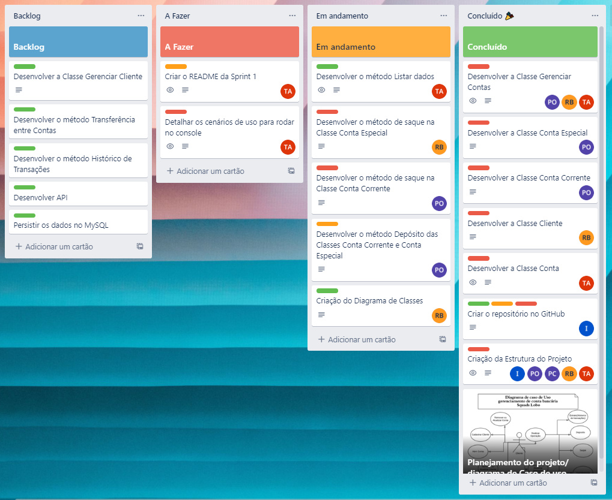
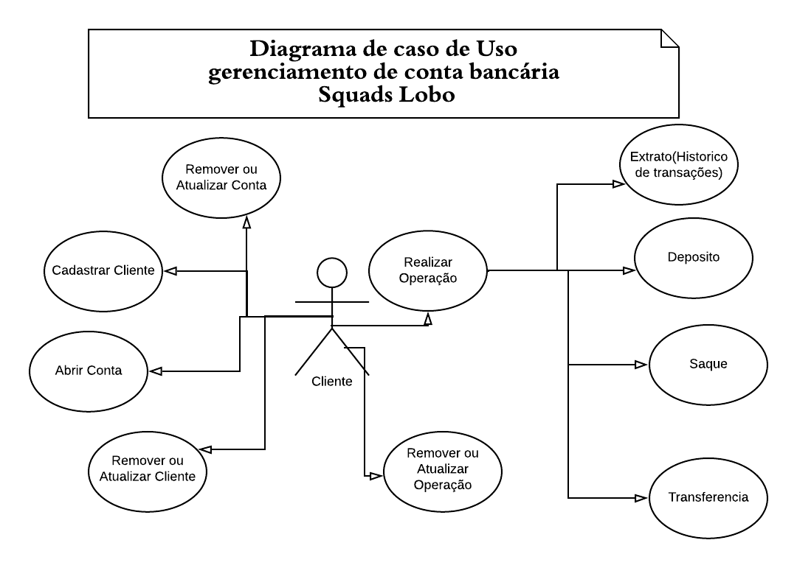

<div style="display: inline_block" align="center">
  <br>
  
  
</div>

<br>

<h1 align="center"> Wipro Bootcamp - Desafio Final</h1>

<br>

A **Wipro** está revolucionando e trazendo uma novidade para os seus clientes. O desafio será elaborar uma aplicação que faça o **gerenciamento de conta bancária**, permitindo que sejam feitas as operações de criação, consulta e remoção, além das operações de saque, depósito e essa conta também deverá ter um cartão de crédito.

O projeto será desenvolvido em três sprints. Cada etapa deve ser entregue em um repositório público no Github.

## Grupo 9 - Squad Lobo 🐺‍

Integrantes:

🐺‍👧 [Ilessa Lobo](https://github.com/ilessalobo)

🐺‍🧑‍ [Paulo Henrique](https://github.com/paulohenriquepaulo)

🐺‍🧑‍ [Roberto Brito](https://github.com/RobertoBrito)

🐺‍🧑‍ [Thiago Araujo](https://github.com/thiagoaraujodev)

## 📰 Organização do Projeto

Na etapa inicial definimos todos os entregáveis previstos para primeira sprint, e de acordo com o planejamento optamos por:

- Utilizar o Trello para elaboração do Kanban
- Criação do backlog
- Detalhamento descritivo das tarefas da squad
- Formatação do kanban padrão "to do, doing, done"
- Priorização dos cards com cores identificando os níveis de prioridade

## 💻 Quadro Kanban



<br>

## 💻 Caso de Uso



## 🚀 Plano de execução - Sprint 1

Como demostrado na imagem do quadro Kanban, seguimos um passo a passo de todo o planejamento definido inicialmente que foram executadas nas seguintes ordens:

**1. Planejamento do projeto**

- Elaboração do Caso de Uso.
 
**2. Criar a Estrutura do Projeto**

- Incluir as classes em seus respectivos pacotes
 
**3. Criar o repositório no GitHub**

- Um integrante da Squad Lobo ficou encarregado de criar um repositório no GitHub
- Após sua criação forneceu o link do repositório para o restante da equipe efetuar o Fork do projeto

**4. Desenvolver a Classe Conta**

- Deve possuir um número, um saldo e um cartão de crédito
- Para estes atributos não é necessário métodos set, apenas métodos GET
- Deve ter métodos para obter dados da conta, realizar depósito e saque
- Esta classe é apenas um modelo e não deve instanciar objetos
	
**5. Desenvolver a Classe Cliente**

- Deve possuir nome, CPF, data de nascimento, telefone e endereço
- Atribuir os métodos Get e Set
	
**6. Desenvolver a Classe Conta Corrente**

- Deve ser herança da classe conta;
- Neste primeiro momento não é necessário incluir a lógica do depósito
- Neste primeiro momento não é necessário incluir a lógica do saque

**7. Desenvolver a Classe Conta Especial**

- Deve ser herança da classe conta contendo um valor de limite
- Neste primeiro momento não é necessário incluir a lógica do depósito
- Neste primeiro momento não é necessário incluir a lógica do saque

**8. Desenvolver a Classe Gerenciar Contas**

- Deve ter o método Criar Conta
- Deve ter o método Criar Cliente
- Deve ter o método Depósito
- Deve ter o método Saque Conta Corrente
- Deve ter o método Saque Conta Especial

**9. Desenvolver o método Depósito das Classes Conta Corrente e Conta Especial**

- Desenvolver a lógica de depósito
- Para realizar o depósito, deve ser informado o número da conta e o valor do depósito

**10. Desenvolver o método de saque na Classe Conta Corrente**

- Desenvolver a lógica de saque
- A operação de saque somente é permitida se houver saldo suficiente na conta
- Para realizar o saque, deve ser informado o número da conta e o valor do saque

**11. Desenvolver o método de saque na Classe Conta Especial**

- Desenvolver a lógica de saque
- A operação de saque pode ser feita se o valor do saldo somado ao limite especial, for menor ou igual ao valor que se deseja sacar
- Para realizar o saque, deve ser informado o número da conta e o valor do saque

**12. Desenvolver o método Listar dados**

- Deve listar os dados de uma conta;
- Deve listar os dados de todas as contas;

**13. Detalhar os cenários de uso para rodar no console**

- Criar um menu ilustrativo de como ficará as funcionalidades abordadas até o momento no console da IDE

**14. Criar o README da Sprint 1**

- Elaborar a descrição com detalhes do que foi produzido na Sprint 1

## 📑 Backlog

Alguns apontamentos já ficaram no backlog para serem desenvolvidos na segunda sprint, como, por exemplo:

- Desenvolver a Classe Gerenciar Cliente
- Desenvolver o método Transferência entre Contas
- Desenvolver o método Histórico de Transações
- Desenvolver a API
- Persistir os dados no MySQL

## 💻 Projeto Rodando no console da IDE


## ⚙️ Como inicializar a aplicação

```ps
# Clone o repositorio utilizando o git
$ git clone https://github.com/thiagoaraujodev/Wipro-Projeto-Final.git

# Acesse a pasta do projeto
$ cd Wipro-Projeto-Final
```
<br>

Inicialmente este projeto está rodando apenas no console da IDE. <br>
Para inicializar é muito simples:

1. Faça um clone do repositório como no exemplo.
2. Em seguida abra a IDE Java de sua preferência.
3. Importe o projeto.
4. Execute a aplicação.

Neste projeto foi utilizado:

- [Java 11](https://www.oracle.com/java/)
- [Eclipse](https://www.eclipse.org/)


### 📝 License 

Este projeto está sob a licença do MIT. Consulte a [LICENSE](LICENSE) para obter mais informações.